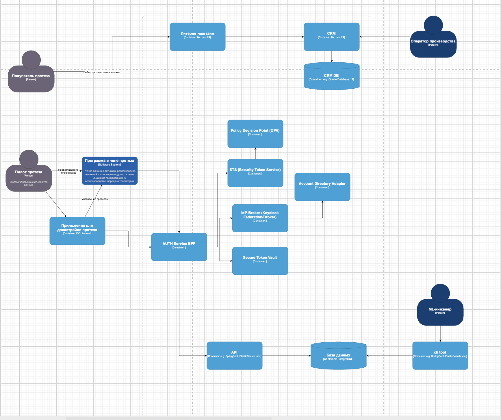
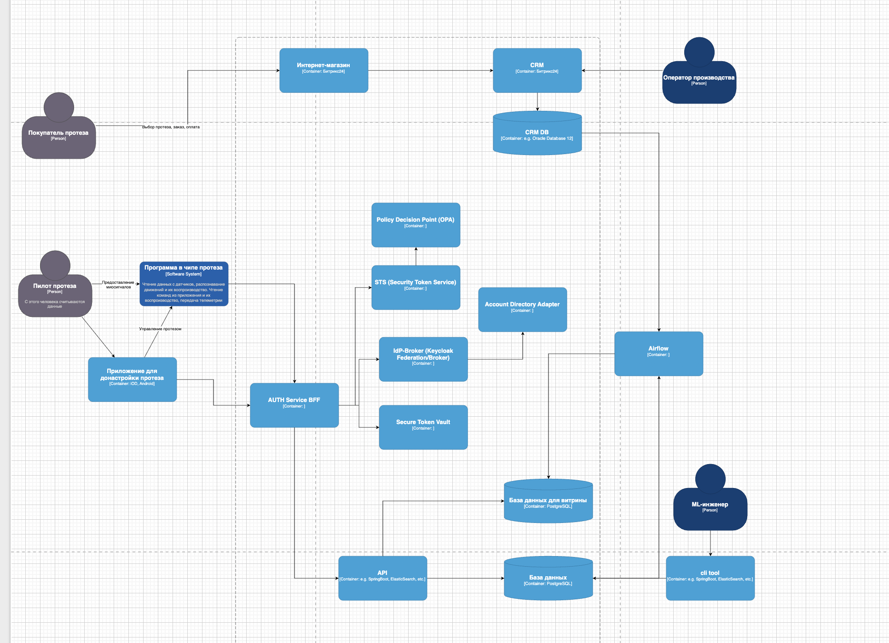

Целевая схема IAM (кратко)

Региональные узлы идентификации (per country)
В каждой стране — свой «узел идентификации»: IdP-broker + каталог аккаунтов + хранилище токенов в пределах юрисдикции. Это может быть Keycloak в режиме Identity Broker (federation) + локальная интеграция с внешним «источником учётных записей» (нац. удостоверяющие службы, ЕСИА/BankID/еIDAS-провайдеры и т. п.).
Персональные и медицинские данные не покидают страну — только минимальные псевдонимные идентификаторы.

Auth Broker (BFF) внутри BionicPRO
Паттерн Backend-For-Frontend для web и мобильных клиентов:

Инициирует OIDC Authorization Code + PKCE с выбранным региональным IdP-broker’ом.

Обменивает код на токены только на сервере; refresh/id/access токены IdP фронтенду не выдаются.

Хранит refresh-токены IdP в региональном Secure Token Vault (HSM/HashiCorp Vault Transit) — шифрование at-rest и привязка к региону.

Выпускает внутренние короткоживущие токены BionicPRO (JWT или PASETO) для API/микросервисов.

Для Web — HttpOnly Secure SameSite=strict cookie с опак-сессией (сервер хранит state).
Для мобильного — DPoP/PoP-токены + attestation (Play Integrity/DeviceCheck) для привязки сессии к устройству.

STS (Security Token Service) + JWKS/OPA
Внутренний STS подписывает короткоживущие токены (5–10 мин), микросервисы валидируют подпись по JWKS. Авторизация — через OPA/ABAC (политики учитывают sub, country, device_ids, scopes, loa).

Device/Prosthesis auth — отдельно от SSO
Протезы и 4G-модуль — по mTLS/клиентскому сертификату или hardware key (eSIM/eUICC). Для чипа — machine-to-machine (Client Credentials) без пользовательских refresh-токенов.

Глобальная унификация без утечки ПДн
Поддерживаем «Global Identity Map» (псевдонимный GUID) в центральной зоне — без ПДн. Сопоставление GUID ↔ локальные subject делается на стороне регионального брокера. Кросс-региональные вызовы — только по GUID и строго минимальный набор атрибутов.

Файл для задачи 2 в keycloak/realm-export-pkce.json

Файл для airflow в airflow/dag.py

