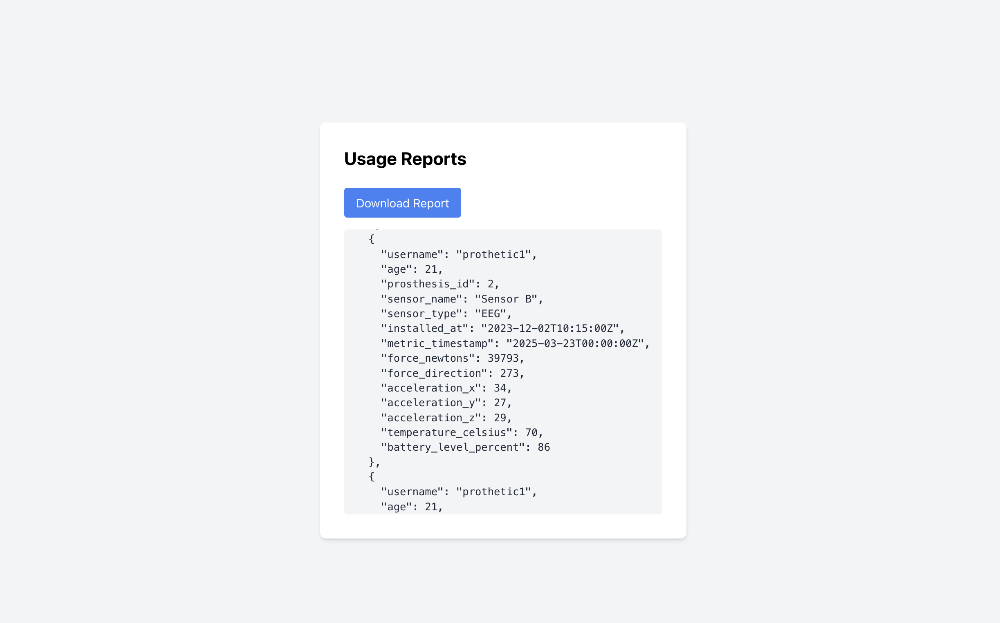
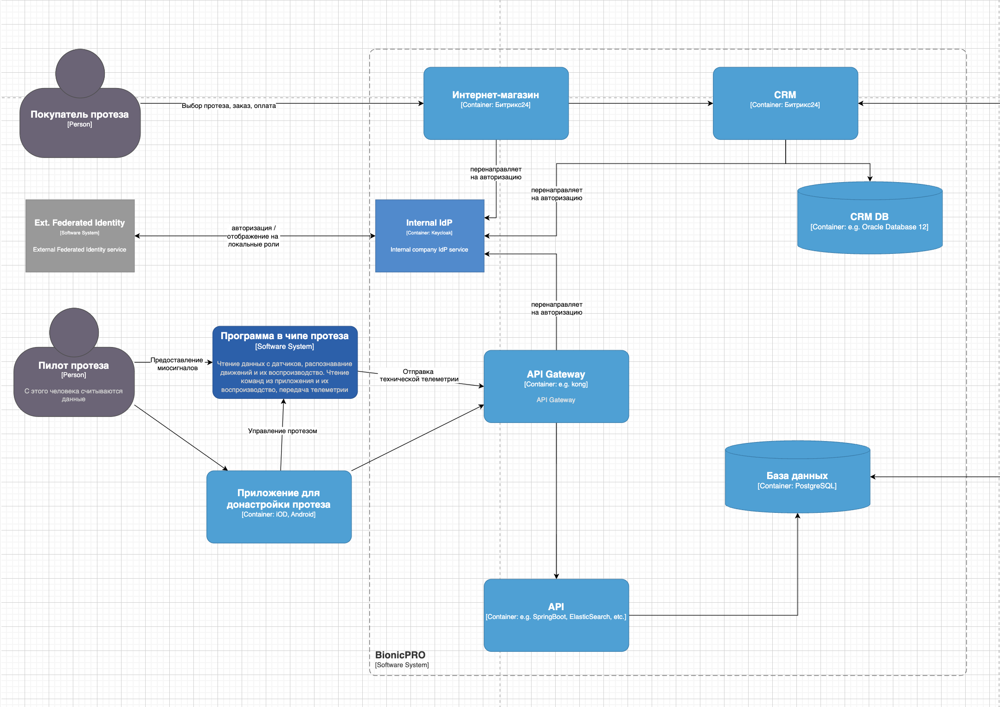
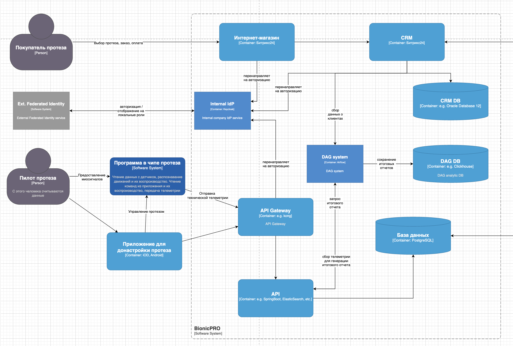
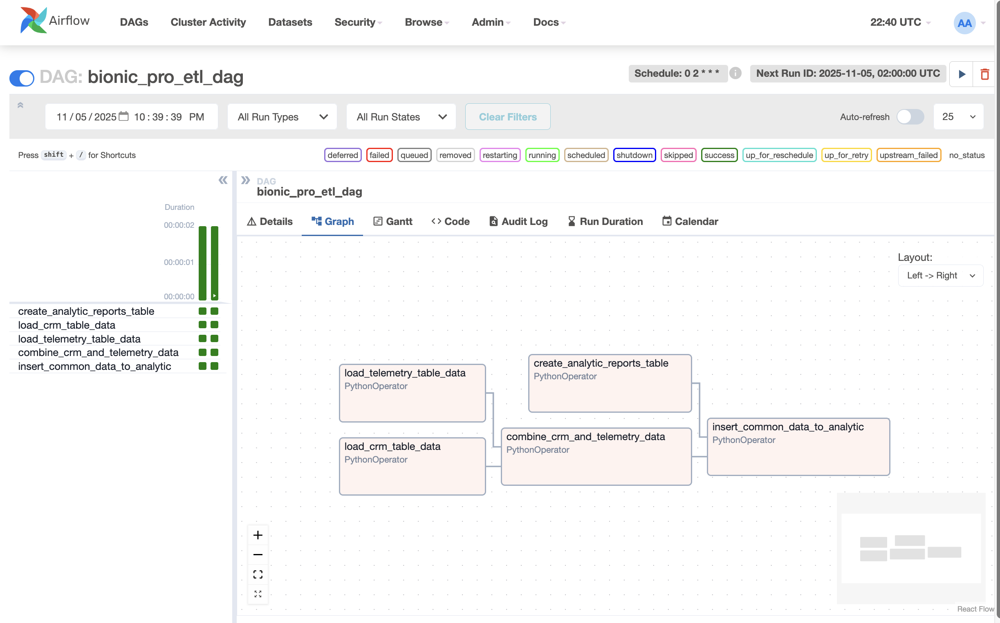

# architecture-bionicpro

## Сдача проектной работы 9 спринта

В этом уроке вы познакомитесь с проектной работой девятого спринта. Это поможет вам оценить её сложность и распланировать своё время.

🔍 Обратите внимание: вам не нужно выполнять эти задания прямо сейчас. Можете пропустить этот урок и перейти к изучению теории. 
В конце спринта будет отдельный урок для сдачи проекта: там мы повторим задания и дадим форму, через которую нужно отправить решение.

В этом спринте будете работать над кейсом BionicPRO — российской компании, которая производит и продаёт бионические протезы.
Чтобы вам было проще разобраться с архитектурными задачами, сперва необходимо рассказать про особенности производства и 
эксплуатации протезов. Именно они сформировали основные вызовы для команды разработки.

### Как работают протезы
Каждый бионический протез состоит из шести компонентов.
1. Миодатчики. Они считывают миосигналы с мышц, которые остались выше культи. Миосигналы — это биоэлектрические сигналы, которые возникают в результате электрической активности мышц.
2. Чип типа ESP32. Он считывает данные с миодатчиков. В чипе установлена программа на C++. Она анализирует миосигналы и по ним определяет, какое действие необходимо совершить. Затем она посылает сигнал актуаторам.
3. Актуаторы. Исполнительные устройства, которые преобразуют электрическую энергию в механическую. Они позволяют протезу выполнять движения, которые соответствуют командам пользователя.
4. Батарея. Источник питания, который обеспечивает энергией все компоненты протеза.
5. Система управления батареей. Она контролирует заряд и разряд батареи, а также предотвращает её перегрев и перегрузку.
6. Корпус. Это оболочка протеза, которая защищает его компоненты от внешнего воздействия.

### Как изготавливают протез

1. Пациент заказывает у компании протез и оплачивает его.
2. После оплаты пациент приходит на первичный замер, чтобы сделать слепки ампутированной конечности. По слепкам делают культеприёмник, который вставляют в протез.
3. Протез изготавливают от одного до двух месяцев. В это время пациент должен периодически посещать офис компании для примерки.
4. Когда протез готов, пациент приходит на финальную примерку.
5. Если во время финальной примерки новые доработки не были запланированы, стартует серия обучений для пользователя. В это время команда записывает индивидуальные миосигналы пациента на протез.

Одно из важнейших свойств протеза — это скорость реагирования. Желательно, чтобы она не превышала 100 миллисекунд. 
В противном случае протезом будет сложно пользоваться.

Обеспечить высокую скорость реагирования непросто. Миодатчики сами по себе производят много шума в данных. Это происходит 
из-за того, что миосигналы достаточно слабые. Их могут искажать электромагнитные помехи от электронных устройств, 
механические вибрации и даже нестабильная работа батареи.

При этом миосигналы каждого человека уникальны. К тому же со временем они могут меняться. Иногда это происходит уже через 
месяц после первичной настройки.

Чтобы повысить скорость реагирования, программу распознавания движения помещают на сам протез — в чип. А чтобы она 
правильно интерпретировала сигналы мышц, её периодически приходится донастраивать.


### Как донастраивать протез

Для этого в BionicPRO разработали приложения на Android и iOS. Они позволяют пилоту протеза самостоятельно донастраивать 
протез в процессе эксплуатации.

Компании важно, чтобы алгоритмы распознавания движения работали как можно быстрее. Чтобы улучшить свою ML-модель, 
BionicPRO собирает и хранит информацию о сигналах и движениях протеза по всем своим пользователям. Чип отправляет данные ч
ерез 4G-модуль.

Изначально компания получала данные с протезов раз в день. Но недавно она переключилась на сбор данных в режиме реального 
времени. По необходимости пользователи могут отключить эту функцию.


### О компании

В компании пять отделов:
 - отдел продаж,
 - отдел производства и эксплуатации,
 - отдел маркетинга,
 - отдел машинного обучения (ML),
 - отдел разработки.

В IT-системе BionicPRO четыре ключевых компонента:
 - Программа в чипе протеза.
 - Приложение для донастройки протеза.
 - Интернет-магазин.
 - CRM.

Диаграмма контейнеров BionicPRO в модели C4:

[bionicpro-c4-model.origin.drawio](docs/bionicpro-c4-model.origin.drawio)

1. Проблемы и бизнес-задачи компании

В последнем уроке первой темы мы реализовали SSO через Oauth2.0 Code Grant в Keycloak. С тех пор компанию успели взломать. 
И это даже несмотря на то, что мы использовали Code Grant.

Хакеры воспользовались уязвимостью и скачали персональные данные пользователей по всем протезам. Ходит слух, что 
утечка дошла до конкурентов BionicPRO, и они уже знают, сколько активных пользователей есть у компании.

Когда информация о взломе достигла СМИ, клиенты BionicPRO подали в суд на компанию. Если не урегулировать конфликт в 
досудебном порядке, есть риск, что компании придётся заплатить большие штрафы.

Директор BionicPRO в срочном порядке созвал собрание руководителей. В ходе обсуждения команда решила, что самая 
приоритетная задача сейчас — это усилить безопасность.

При решении проблемы важно не забывать о том, что пользователи узнали о сборе данных и теперь хотят получать больше 
информации о работе своих протезов. Они требуют, чтобы разработчики добавили в приложение возможность скачать отчёт о 
работе протеза. Чтобы урегулировать судебные иски, компания пошла на уступки и пообещала предоставить такую функцию для 
пользователей Android-приложения.

Ещё несколько важных проблем, с которыми столкнулась компания:
 - Огромный объём данных. Изначально у компании была только одна база данных — PostgreSQL. Очень быстро она начала 
ухудшать показатели работы системы. Команда попробовала использовать индексы, но и это не помогло: слишком большое 
количество данных начало влиять на остальные таблицы базы.

 - Выход на новые рынки и соблюдение требований законодательства. Компания сейчас работает только в России, но планирует 
осваивать новые рынки и развивать свои продукты в других странах. BionicPRO работает с медицинскими данными, и во многих 
странах есть требования к хранению такой информации. Нужно учитывать, что правовое регулирование в разных странах может 
отличаться. Важно продумать, как будут храниться данные о пациентах, в том числе — авторизационные.

2. Цели бизнеса

Компания BionicPRO ставит перед собой следующие цели:

 - Злоумышленники не должны использовать уязвимость SSO в приложении.
 - У пользователей должна быть возможность скачать данные о работе протеза в виде отчёта. Чтобы реализовать эту функциональность,
необходимо выгружать данные из CRM в ClickHouse. Для этого требуется написать отдельное приложение, которое сможет предоставлять 
отчёт из нескольких источников — CRM и DB.
 - Пользователь должен иметь доступ только к тем отчётам, которые содержат данные о его протезе или протезах. Доступ к 
информации о других пользователях должен быть закрыт.


## Task 1

#### Задача 1. Предложите архитектурное решение и доработайте диаграмму C4 для управления учётными данными пользователя.

Решение должно учитывать и обеспечивать следующие аспекты:
 - Унификацию доступа в системе BionicPRO. Это будет осуществляться через запрос данных учётных записей из внешнего источника, 
который расположен в стране представительства компании. Принципы локального хранения персональной и медицинской информации 
не должны быть нарушены.

 - Безопасную схему работы с access- и refresh-токенами, которая исключает передачу фронтенду токенов, которые были получены от IdP.
 - Возможность поддержки аутентификации пользователей через различные внешние удостоверяющие службы, действующие в разных странах.
 - Для подготовки архитектуры решения используйте draw.io.

#### Задача 2. Улучшите безопасность существующего приложения, заменив Code Grant на PKCE.

Его нужно добавить к уже существующим приложениям — фронтенду и Keycloak. Мы неслучайно не рассказывали в теории, как 
это сделать. Чтобы разобраться, изучите официальную документацию.



#### Результат выполнения задач

Схема системы:
[bionicpro-c4-model.auth.drawio](docs/bionicpro-c4-model.auth.drawio)


Был также реализован backend для возвращения report данных пользователя.


**Для запуска keycloak без SSL**
Возможно потребуется сделать следующие шаги после поднятия контейнера: 
```shell
cd /opt/keycloak/bin

/kcadm.sh config credentials --server http://localhost:8080/ --realm master --user admin
<enter admin password>

# Для доступа к админ панели
./kcadm.sh update realms/master -s sslRequired=NONE

# Для доступа из frontend'а
./kcadm.sh update realms/reports-realm -s sslRequired=NONE
```


## Task 2

Пользователи хотят, чтобы у них была возможность получать данные о работе своего протеза и просматривать их в виде отчёта.
Вам нужно написать отдельный сервис для отчётов. Он будет генерировать отчёты из данных, которые собираются из разных источников, — CRM и DB.

Что нужно сделать

#### Задача 1. Создать архитектуру решения для подготовки и получения отчётов.

Решение должно включать в себя ETL-процесс, который объединяет данные с датчиков и данные из CRM, используя Apache Airflow, 
и формирует готовую витрину отчётности в OLAP БД. Итоговый отчёт по пользователю должен быть доступен через бэкенд-сервис 
API, который обозначен на исходной архитектуре.

Для подготовки архитектуры решения используйте draw.io.

#### Задача 2. Разработать Airflow DAG и настроить его на запуск по расписанию.

1. Реализуйте ETL-процесс с использованием Airflow, который будет извлекать данные из CRM-системы и записывать их в базу OLAP.
2. Подготовьте витрину — отдельную таблицу для сервиса отчётов, в которой вам предстоит объединить данные телеметрии и данные 
о клиентах из CRM-системы. Для этого нужно будет сгруппировать аналитику по телеметрии в разрезе клиентов. Спроектируйте 
структуру витрины таким образом, чтобы обеспечить быстрый доступ к данным по пользователям. За основу при написании DAG 
можно взять материал уроков спринта.
3. Настройте расписание сбора данных и подготовки витрины.

#### Задача 3. Создайте бэкенд-часть приложения для API.

1. Выберите удобный для вас язык — Python, Java, C# или любой другой.
2. Добавьте API /reports в этот бэкенд для передачи отчётов, который будет возвращать подготовленный отчёт по заданному пользователю. 
Отчёт должен запрашиваться из OLAP-базы без необходимости выполнять сложные вычисления в реальном времени.

#### Задача 4. Реализуйте ограничение доступа к эндпоинту отчётности.
Доступ к отчёту по пользователю должен предоставляться только в отношении себя.

#### Задача 5. Добавьте в UI кнопку получения отчёта и вызова эндпоинта его генерации.

#### Результат выполнения задач

Схема системы:
[bionicpro-c4-model.airflow.drawio](docs/bionicpro-c4-model.airflow.drawio)


Генерация отчета в airflow:

