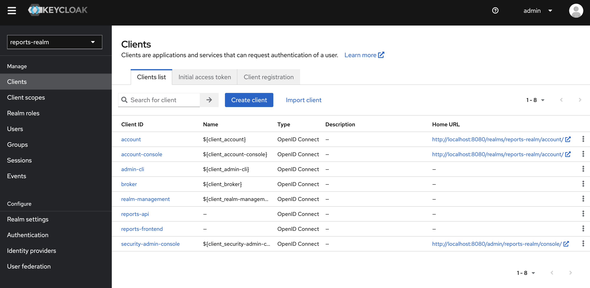
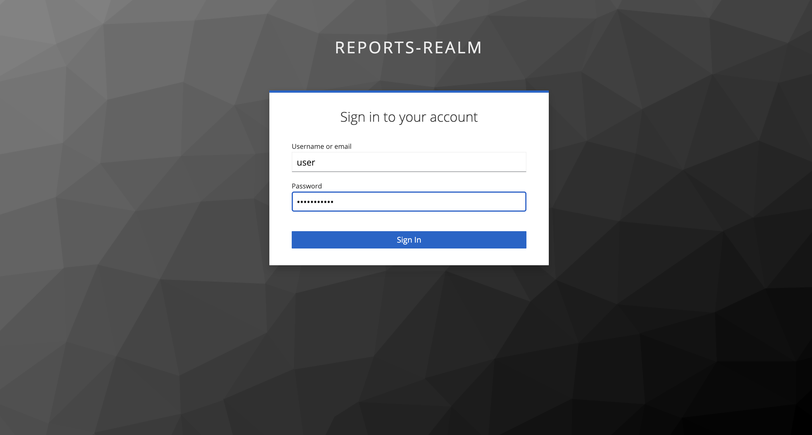
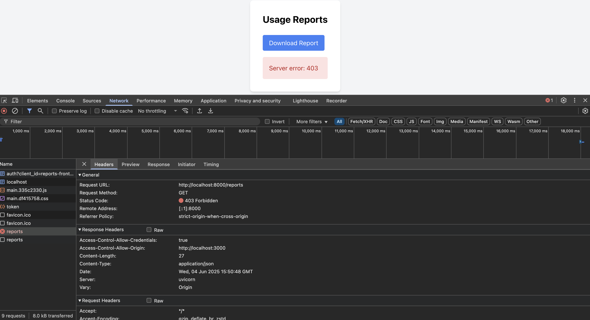
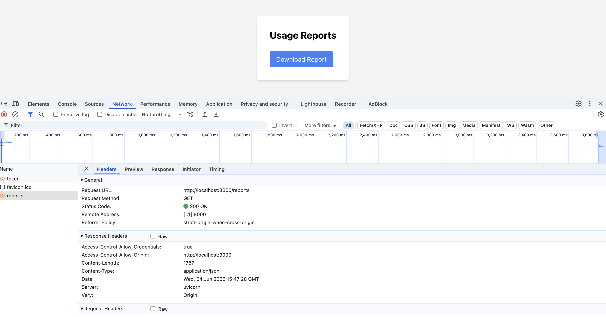
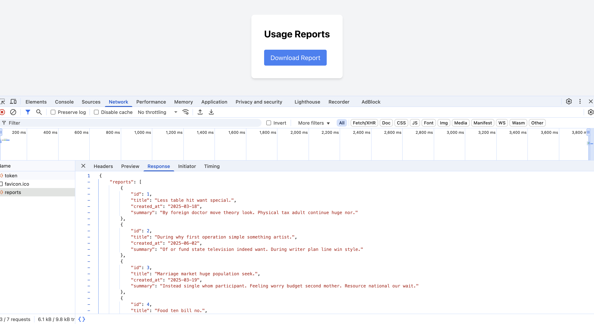
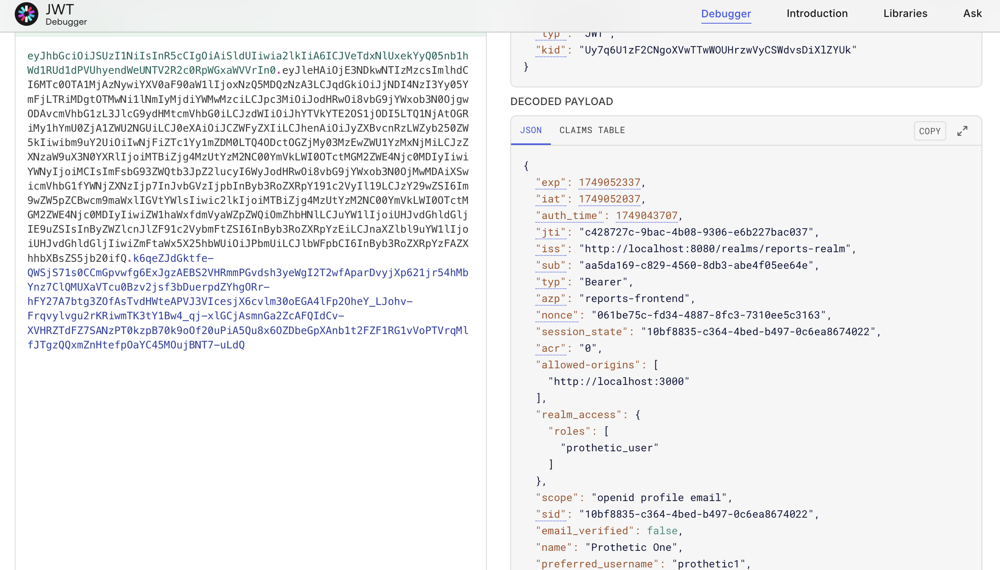

# Интеграция микросервисов через SSO и аналитическая платформа

## Описание проекта

Комплексное решение, объединяющее авторизацию через **Keycloak (SSO)**, серверную часть на **FastAPI**, и клиентский интерфейс на **React**. Система предназначена для безопасной работы с аналитическими данными и может служить основой для построения внутреннего портала, административной панели или системы отчетности.

---

## Компоненты системы

| Компонент     | Назначение                                                |
|---------------|------------------------------------------------------------|
| `keycloak_db` | Хранилище пользователей и конфигурации Keycloak (PostgreSQL) |
| `keycloak`    | Сервер аутентификации и управления доступом (SSO)         |
| `backend`     | API-сервер на FastAPI с защищёнными эндпоинтами           |
| `frontend`    | Веб-клиент на React с поддержкой авторизации через Keycloak |

---

## Предварительные требования

Перед запуском убедитесь, что:

- Установлены **Docker** и **Docker Compose**
- Порты `8080`, `8000`, `3000`, `5433` свободны
- Файл `keycloak/realm-export.json` содержит валидный экспорт реалма `reports-realm`

---

## Инструкция по запуску

1. Выполните сборку и запуск всех сервисов:

```bash
docker-compose up --build
```

2. Остановить сервисы:

```
docker-compose stop
```

## Проверка сервера Keycloak

1. Перейдите в http://localhost:8080
2. Введите данные администратора:
```
Login:    admin  
Password: admin
```
3. Убедитесь, что:
    - Импортирован реалм: reports-realm
    - Существуют клиенты:
        - reports-api
        - reports-frontend

    - Создан тестовый пользователь с ролью: **prothetic_user**

## Проверка клиентской части приложения

### Админ панель Keycloak


### Авторизация под аккаунтом User (ожидается получить 403/401)


### Получаем 403: Access denied.


### Попытка получения отчетов под аккаунтом prothetic-user (ожидается 200)


### Получаем 200: Список отчетов.


### Проверяем детали токена с помощью jwt.io decoder

