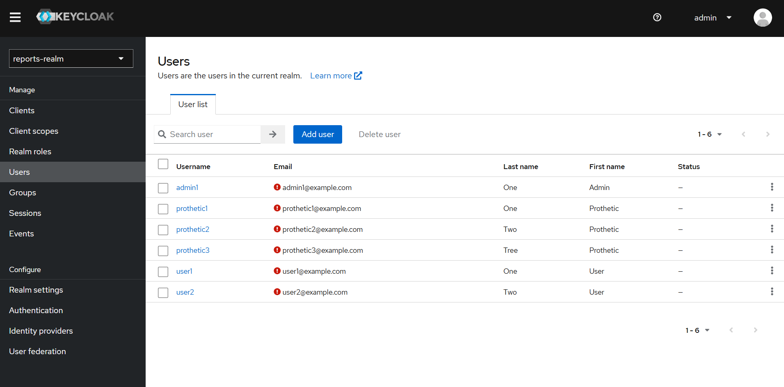

# Задание 1

## Предложите архитектурное решение и доработайте диаграмму C4 для управления учётными данными пользователя

## Улучшите безопасность существующего приложения, заменив Code Grant на PKCE

- в настройку realms, в клиент `reports-frontend` добавлен атрибут `"pkce.code.challenge.method": "S256"`.
- в свойство `initOptions` компонента `ReactKeycloakProvider` добавлен атрибут `pkceMethod: "S256"`

Новые параметры в URI:

## Обеспечьте безопасное получение и хранение access-и refresh-токенов

- реализован бэкенд bionicpro-auth, который выполняет PKCE аутентификацию и клиента `reports-frontend`, и замещает токены на ключ сессии.
- добавлен redis для хранения сессии PKCE и сессии клиента.
- фронтенд теперь при нажатии на логин переадресовывается на бэкенд для получения ключа сессии.
- клиент `reports-frontend` в `keycloak` настроен на обновление токенов доступа и обслуживание нового `redirectUri`

Добавление session_key в cookie бэкендом после аутентификации:

## Добавьте LDAP для возможности получения данных о пользователях представительства BionicPRO в другой стране

- развернут LDAP сервер OpenLDAP
- настроен Keycloak

Список пользователей, "прилетевших" из LDAP:

